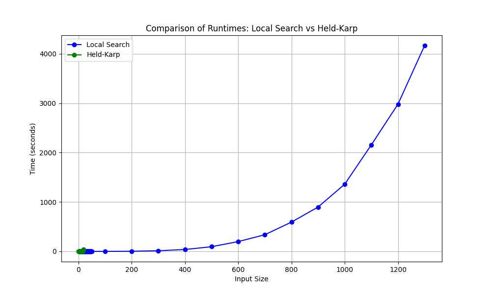
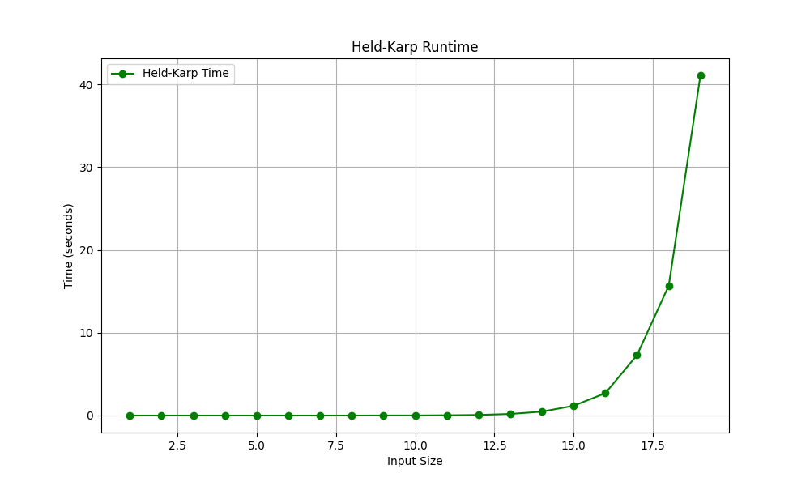
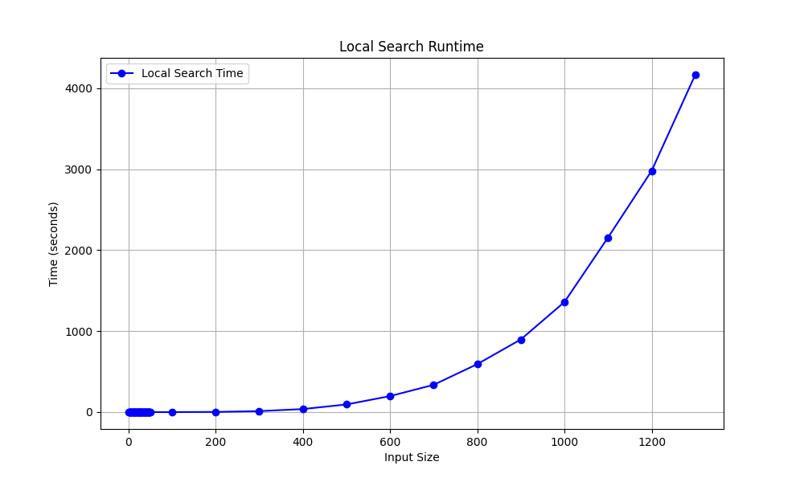

# Traveling Salesperson Problem -- Empirical Analysis

For this exercise, you'll need to take the code from the TSP Held-Karp and TSP
Local Search exercises. This can be your own implementation or somebody else's.
You will now do an empirical analysis of the implementations, comparing their
performance. Both the Held-Karp and the Local Search algorithms solve the same
problem, but they do so in completely different ways. This results in different
solutions, and in different times required to get to the solution.

Investigate the implementations' empirical time complexity, i.e. how the runtime
increases as the input size increases. *Measure* this time by running the code
instead of reasoning from the asymptotic complexity (this is the empirical
part). Create inputs of different sizes and plot how the runtime scales (input
size on the $x$ axis, time on the $y$ axis). Your largest input should have a
runtime of *at least* an hour. The input size that gets you to an hour will
probably not be the same for the Held-Karp and Local Search implementations.

In addition to the measured runtime, plot the tour lengths obtained by both
implementations on the same input distance matrices. The length of the tour that
Held-Karp found should always be less than or equal to the tour length that
Local Search found. Why is this?

Add the code to run your experiments, graphs, and an explanation of what you did
to this markdown file.

The comparisons between my two algorithms isnt very interesting because the largest inputsize that would ever produce an output on my machine was 19 for the held-karp implementation. I dont know why this is because its not running out of memory its just never producing an output, i let it run for 4 days on my server at home and while it never errored out it never completed either. Doing a quick approximation based on the time that the previous input took it should have taken around 500 seconds to produce an output at input size of 20, that wasnt the case however. i simply dont have enough time let let it run forever and hope that it will produce an output. in my code i just hardlimited it to only accecpt inputs smaller than 20.

This is the graph of the input size and the runtime for both the implementations.

This is the graph of the input size and the runtime for karp implementation.

the limited sample size of the karp that does run resembles an factorial function. 20 was the size of the input that took longer than an hour.

This is the graph of the input size and the runtime for local search implementation.

The graph of the ls clearly shows exponential runtime. 1300 was the input size that took longer than an hour.

The graph of the output result of the karp vs the ls shows that ls is greaterthan or equal to that of karp. this is because karp finds the optimal trip though the graph while ls is an approximation.

I asked chatGPT to write the code for graphing in python. Everything else is mine.

I certify that I have listed all sources used to complete this exercise, including the use of any Large Language Models. All of the work is my own, except where stated otherwise. I am aware that plagiarism carries severe penalties and that if plagiarism is suspected, charges may be filed against me without prior notice.